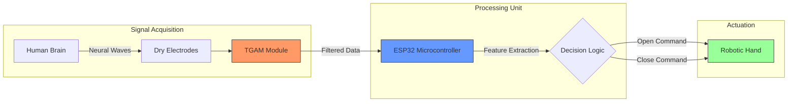
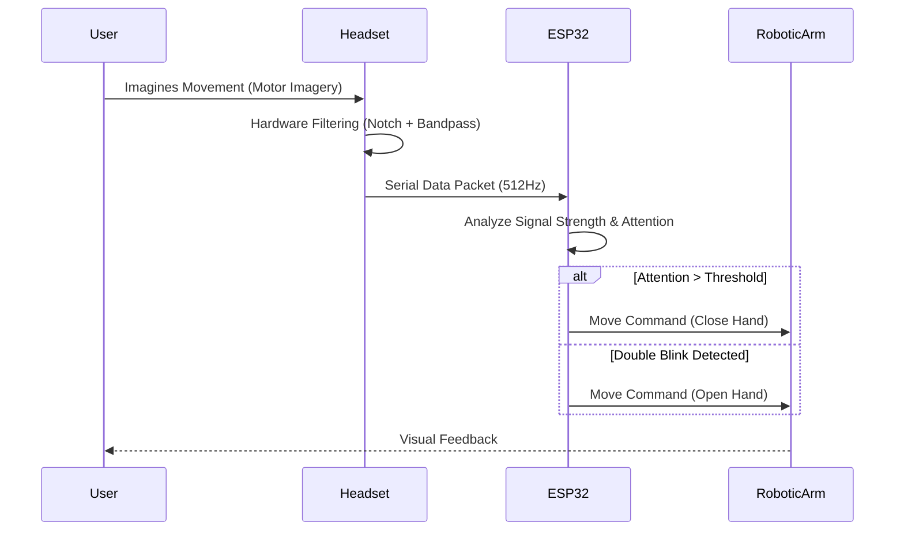

<!-- Banner -->

  <b>Brain-Controlled Prosthetic Arm (Non-Invasive BCI)</b> 
  Assistive Neurotechnology • Embedded Systems • Human-Machine Interaction

  Developed with ❤️ for Accessible Healthcare Innovation

  
  
  
  

---

---

# Brain-Controlled Prosthetic Arm (BCI)

This project presents a non-invasive **Brain-Computer Interface (BCI)** system designed to restore mobility for individuals with upper-limb impairments. It translates neural intent (EEG signals) into mechanical actions (Prosthetic Arm movements) using real-time signal processing and embedded intelligence.

---

## 📋 Project Objective

To develop a low-cost, high-accuracy assistive device that:

1. Captures raw brainwaves using a single-channel EEG headset.
2. Filters out **gratuitous frequencies** and artifacts (noise).
3. Interprets user intent (Blinks/Attention) to control a **3D-designed prosthetic arm**.
4. Provides a safe, non-invasive alternative to surgical implants.

---

## 🏗 System Architecture (Design Logic)

The system follows a modular pipeline from signal acquisition to mechanical actuation.

---

## 🛠 Hardware Specifications

### **Primary Components**

* **Sensor Unit:** **TGAM (ThinkGear AM)** Module with integrated ASIC for hardware-level filtering.
* **Processing Unit:** **ESP32** (32-bit Dual Core) – chosen for its high-speed clock and built-in Bluetooth/WiFi capabilities.
* **Electrodes:** Non-invasive Dry Electrodes (Forehead placement at Fp1).
* **Power:** 9V Lithium-Ion Battery with a voltage regulator for stable 3.3V/5V rails.

### **Mechanical Design**

* **Structure:** 3D Printed Prosthetic Hand (PLA/ABS).
* **Actuators:** High-torque Servo Motors (for finger flexion and extension).
* **Transmission:** Bio-inspired tendon-wire system.

---

## 🧪 Development & Troubleshooting (Engineering Logs)

The project evolved through iterative testing of different hardware configurations:

| Phase | Setup | Result | Observation |
| --- | --- | --- | --- |
| **01** | Arduino + ADS1256 | **FAILED** | The 8-bit Arduino processor was not capable of real-time sampling and complex math for EEG. |
| **02** | ESP32 + ADS1256 | **FAILED** | High **gratuitous frequency** (50Hz noise) and electrical interference masked the brain signals. |
| **03** | **ESP32 + TGAM** | **SUCCESS** | The TGAM’s built-in **Notch Filter** and Bandpass filters provided clean, stable data. |

---

## 💻 Software Workflow

The logic focuses on detecting **Attention Levels** and **Eye Blinks** to trigger the prosthetic hand.

---

## 📐 3D Design & Modeling

The arm structure was designed in CAD to mimic natural human anatomy.

* **Degrees of Freedom (DOF):** 5-DOF (Individual finger movement).
* **Material:** Optimized for 3D printing with reinforced joints to prevent mechanical wear.
* **Simulation:** Tested in a virtual environment for workspace restrictions before physical prototyping [15].

---

## 👥 Project Credits

### **Development Team**

* **Saqib Azair** – Lead Hardware Developer & System Integration.
* **Hiba Zari Nadeem** – Research Lead & Documentation.
* **Shahbano** – 3D Modeling & CAD Design.

### **Supervision**

* **Supervisor:** Mr. Syed Waleed Hussain
* **Co-Supervisor:** Dr. Umair Muneer Butt
* **Department:** Computer Science, **UMT Sialkot**.

---

## 📚 Core References (APA)

1. **Zaim, A., et al. (2025).** *Iterative learning networks for brain-signal calibration*. Journal of Rehabilitation Robotics.
2. **Chen, X., & Wang, Y. (2025).** *Deep learning for synchronizing human thoughts with robotic systems*. Journal of Neural Engineering.
3. **Torad, M., et al. (2024).** *Brain-controlled robotic arm system using EEG signal*. International Journal of Industry and Sustainable Development.
4. **Cutipa-Puma, D. R. (2023).** *A low-cost robotic hand prosthesis controlled by EEG signals*. HardwareX.

---
## 📸 System Preview

  

---

## 🎥 Project Demonstration

  <video src="assets/videos/demo.mp4" controls width="700"></video>

### **How to Deploy**

1. **Wire up:** Connect TGAM TX to ESP32 RX.
2. **Code:** Flash `ESP32_BCI_Logic.ino` using Arduino IDE.
3. **Calibrate:** Wear the headset and stay still for 10 seconds to establish the signal baseline.
4. **Action:** Focus on a single thought or blink twice to see the prosthetic arm move.
---

  © 2026 Brain-Computer Interface Research Project 
  Department of Computer Science • UMT Sialkot

